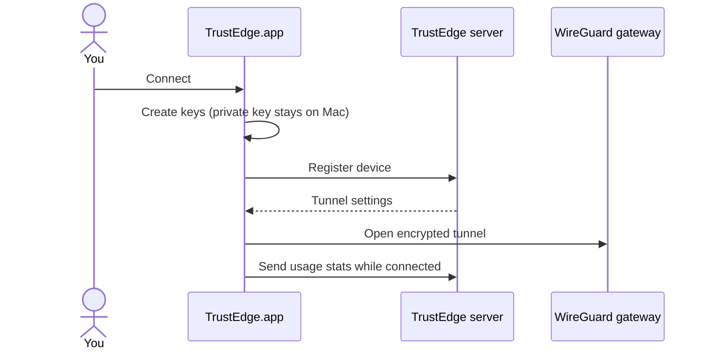

<p align="center">
  <strong>TrustEdge</strong>
</p>

<p align="center">
  macOS menu bar app — connect to your TrustEdge network in one click.
</p>

<p align="center">
  <a href="https://github.com/TrustEdgeOrg/TrustEdgeClient">TrustEdgeClient</a> ·
  <a href="https://github.com/TrustEdgeOrg/TrustEdge">TrustEdge platform</a>
</p>

---

## What is this?

**TrustEdge** is a Mac app that lives in your menu bar. It connects your Mac to a [TrustEdge](https://github.com/TrustEdgeOrg/TrustEdge) network — securely, without managing WireGuard files yourself.

Click **Connect** and the app:

- Registers your Mac with the TrustEdge server
- Opens an encrypted VPN tunnel
- Routes DNS through TrustEdge so policy applies to all apps
- Shows your connection status and live traffic in the menu bar

---

## What you need

- **macOS**
- Your **TrustEdge API URL** (from your admin)
- An optional **API token** (only if your admin gave you one)

---

## Setup (3 steps)

### 1. Get the app

**From source (development):**

```bash
git clone https://github.com/TrustEdgeOrg/TrustEdgeClient.git
cd TrustEdgeClient
make install-gui
```

**Or build a standalone app:**

```bash
make build-mac
open dist/TrustEdge.app
```

You can copy `TrustEdge.app` to your Applications folder.

> First launch: if macOS blocks the app, right-click **TrustEdge.app** → **Open**.

---

### 2. Add your server address

Create a `.env` file with your TrustEdge server URL.

**Development (running from source):**

```bash
cp .env.example .env
```

**Installed app** — create this file:

```
~/Library/Application Support/TrustEdgeClient/.env
```

Put this inside (replace with your real server):

```env
TRUSTEDGE_API_URL=https://your-api.example.com
TRUSTEDGE_API_TOKEN=
```

Leave `TRUSTEDGE_API_TOKEN` empty unless your admin gave you a token.

---

### 3. Connect

**Development:**

```bash
make run-gui
```

**Installed app:** open **TrustEdge** from Applications. Click the menu bar icon → **Connect**.

macOS will ask for your password — that’s normal. The VPN needs admin access to set up the tunnel.

---

## The connection panel

<p align="center">
  
</p>

When connected you can see:

- Your **VPN IP address**
- **Gateway** and DNS info
- **Live upload / download** speeds
- How long you’ve been connected

Click **Disconnect** when you’re done.

---

## What happens when you connect?

1. TrustEdge creates encryption keys on your Mac. Your **private key never leaves the device**.
2. The app registers your Mac with the TrustEdge server.
3. The server sends back tunnel settings (address, DNS, server key).
4. The VPN tunnel opens and DNS is pointed at TrustEdge.
5. Your admin can see live bandwidth for your device on the dashboard.

<details>
<summary><strong>See the technical flow</strong></summary>



</details>

---

## Troubleshooting

| Problem | What to do |
|---------|------------|
| “No API URL configured” | Add `TRUSTEDGE_API_URL` to your `.env` file (see step 2) |
| macOS asks for password | Expected — allow it so the tunnel can start |
| App won’t open (security warning) | Right-click **TrustEdge.app** → **Open** |
| Already connected / stuck | Quit the app and try **Disconnect**, then reconnect |
| No traffic on dashboard | Disconnect and connect again once |

---

## Links

- [TrustEdge platform](https://github.com/TrustEdgeOrg/TrustEdge) — server, dashboard, and policy engine
- [TrustEdgeOrg](https://github.com/TrustEdgeOrg) on GitHub

---

<p align="center">
  <sub>Need help? Open an issue on <a href="https://github.com/TrustEdgeOrg/TrustEdgeClient">GitHub</a>.</sub>
</p>
