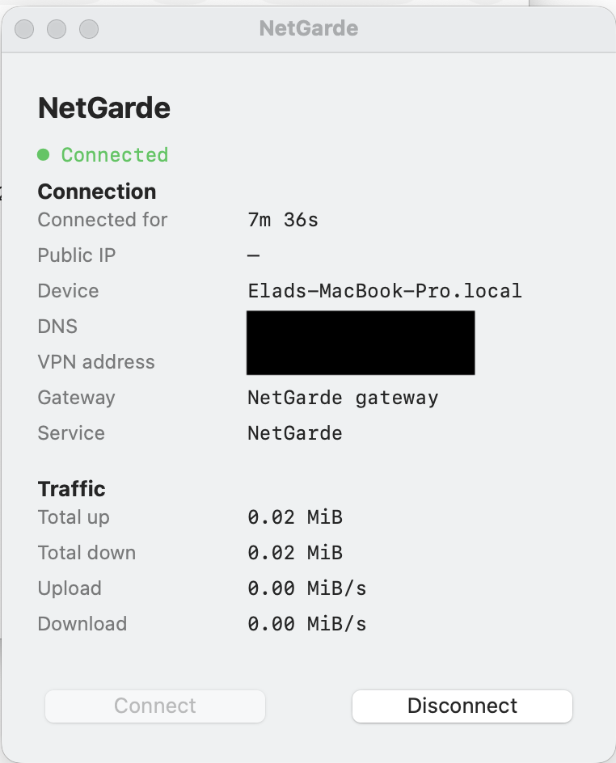
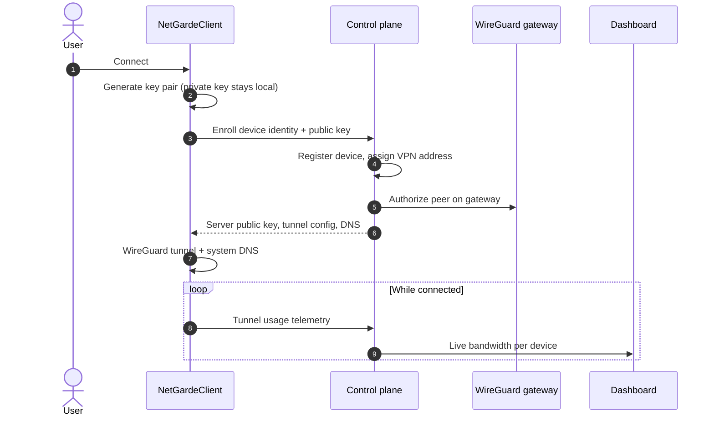

<p align="center">
  <strong>NetGardeClient</strong><br/>
  macOS WireGuard client &amp; menu bar app for the NetGarde zero-trust platform
</p>

<p align="center">
  <a href="https://github.com/NetGarde">Organization</a> ·
  <a href="https://github.com/NetGarde/NetGarde">Platform</a> ·
  <a href="https://github.com/NetGarde/NetGardeClient">Client</a>
</p>

---

## About

**NetGardeClient** is the device-side companion to [NetGarde](https://github.com/NetGarde/NetGarde) — a self-hosted network security platform I built end to end (control plane, dashboard, policy engine, and AWS deployment).

This repo is the **secure access layer**: enroll a device, establish a WireGuard tunnel, route DNS through the platform gateway, and report live usage back to the admin dashboard.

**Deliverables**

- **`NetGarde.app`** — native macOS menu bar application  
- **`netgarde-wg`** — cross-platform CLI for Linux and Windows  
- **Packaged build pipeline** — PyInstaller bundle + GitHub Actions  

---

## Screenshots

<p align="center">
  
</p>

<p align="center"><em>Connection panel — status, session details, live traffic, connect / disconnect</em></p>

---

## What this project shows

| | |
|---|---|
| **Network security** | WireGuard VPN, device enrollment, DNS policy path through the gateway |
| **Systems engineering** | TUN interfaces, routing, privileged macOS DNS and tunnel lifecycle |
| **Product engineering** | Menu bar UX, connection panel, session handling, orphan cleanup |
| **Full-stack integration** | Client ↔ control plane ↔ live dashboard telemetry |
| **Shipping software** | PyInstaller macOS app, CI build, installable `.app` bundle |

---

## How secure connect works

When the user clicks **Connect**, the client runs a zero-trust enrollment flow — no pre-shared WireGuard config file required.

**1. Device identity & keys**  
The client generates a **WireGuard key pair**. The **private key never leaves the device**. Only the **public key** is sent to the platform, together with a stable device identity (hostname, hardware id).

**2. Enrollment**  
The control plane validates the request, registers the device, assigns a VPN address from its pool, and tells the gateway to accept this peer.

**3. Tunnel configuration**  
The server returns everything the client needs: server public key, tunnel address, DNS gateway, and routing rules. The client builds the WireGuard session locally.

**4. Connect**  
The tunnel comes up (TUN interface + routes). DNS is pointed at the platform gateway so **policy applies to all lookups** — not just browser traffic.

**5. Live visibility**  
While connected, the client reports tunnel usage to the dashboard so operators see **live bandwidth** per device.



> **Why this matters:** identity is established *before* access is granted; keys are asymmetric (no shared secret on the wire); policy enforcement stays on the infrastructure you control — the same principles as enterprise ZTNA, in a project you can demo end to end.

---

## How it fits in NetGarde

```
  Laptop / phone                    NetGarde platform
  ─────────────                     ─────────────────
  NetGardeClient  ── enroll ──►     API + device identity
        │                           WireGuard gateway
        ├── tunnel + DNS ──►        DNS policy (dnsmasq)
        └── usage stats ──►         Live dashboard charts
```

Policy, blocking, quarantine, and monitoring live on the **server**. The client focuses on **connectivity and visibility** — the same split you see in enterprise ZTNA / SASE products.

---

## Built with

Python · WireGuard · wireguard-go · rumps · AppKit · PyInstaller · GitHub Actions

Backend & dashboard: [NetGarde platform →](https://github.com/NetGarde/NetGarde)

---

## Explore

| | |
|---|---|
| [NetGarde](https://github.com/NetGarde/NetGarde) | Platform — FastAPI, React, DNS policy, behavior analytics, AWS |
| [NetGarde org](https://github.com/NetGarde) | Project home |

---

<p align="center"><sub>Portfolio & educational use</sub></p>
