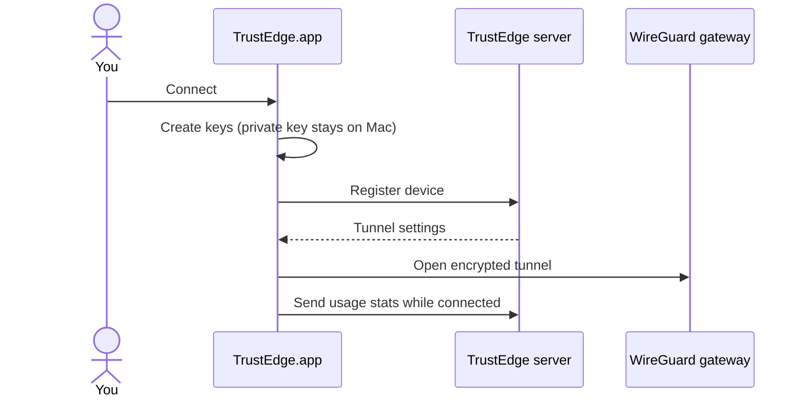

<p align="center">
  <strong>TrustEdge</strong>
</p>

<p align="center">
  macOS menu bar app — connect to your TrustEdge network in one click.
</p>

<p align="center">
  <a href="https://github.com/TrustEdgeOrg/TrustEdgeClient">TrustEdgeClient</a> ·
  <a href="https://github.com/TrustEdgeOrg/TrustEdge">TrustEdge platform</a>
</p>

---

## What is this?

**TrustEdge** is a Mac app in your menu bar. It connects your Mac to a [TrustEdge](https://github.com/TrustEdgeOrg/TrustEdge) network — no WireGuard files to manage.

Click **Connect** and the app:

- Registers your Mac with the TrustEdge server
- Opens an encrypted VPN tunnel
- Routes DNS through TrustEdge so policy applies to all apps
- Shows connection status and live traffic

---

## What you need

- **macOS**
- Your **TrustEdge API URL** (from your admin)
- An optional **API token** (only if your admin gave you one)

---

## Install (3 steps)

### 1. Get TrustEdge.app

**From a release** — download `TrustEdge.app` from [GitHub Releases](https://github.com/TrustEdgeOrg/TrustEdgeClient/releases) and copy it to **Applications**.

**Or build it yourself** (requires Xcode command-line tools and Python 3.9+):

```bash
git clone https://github.com/TrustEdgeOrg/TrustEdgeClient.git
cd TrustEdgeClient
make build-mac
cp -R dist/TrustEdge.app /Applications/
```

> **First launch:** if macOS blocks the app, right-click **TrustEdge.app** → **Open**.

See [docs/BUILD.md](docs/BUILD.md) for build details and troubleshooting.

---

### 2. Configure your server

Create this file:

```
~/Library/Application Support/TrustEdgeClient/.env
```

Paste your server settings (ask your admin for the URL):

```env
TRUSTEDGE_API_URL=https://your-api.example.com
TRUSTEDGE_API_TOKEN=
```

Leave `TRUSTEDGE_API_TOKEN` empty unless your admin gave you a token.

> This file contains secrets. Never share it or commit it to git.

---

### 3. Connect

1. Open **TrustEdge** from Applications
2. Click the menu bar icon
3. Click **Connect**

macOS will ask for your password — that’s normal. The VPN needs admin access to start.

---

## Connection panel

<p align="center">
  
</p>

When connected you can see:

- Your **VPN IP address**
- **Gateway** and DNS info
- **Live upload / download** speeds
- How long you’ve been connected

Click **Disconnect** when you’re done.

---

## What happens when you connect?

1. TrustEdge creates encryption keys on your Mac. Your **private key never leaves the device**.
2. The app registers your Mac with the TrustEdge server.
3. The server sends tunnel settings (address, DNS, server key).
4. The VPN tunnel opens and DNS is pointed at TrustEdge.
5. Your admin sees live bandwidth for your device on the dashboard.

<details>
<summary><strong>Technical flow</strong></summary>



</details>

---

## Troubleshooting

| Problem | What to do |
|---------|------------|
| “No API URL configured” | Create the `.env` file in step 2 with `TRUSTEDGE_API_URL` |
| macOS asks for password | Expected — allow it so the tunnel can start |
| App won’t open (security warning) | Right-click **TrustEdge.app** → **Open** |
| Stuck / already connected | Quit the app, click **Disconnect**, then reconnect |
| No traffic on dashboard | Disconnect and connect once more |

More help: [docs/BUILD.md](docs/BUILD.md#troubleshooting-build)

---

## More documentation

| Doc | For |
|-----|-----|
| [docs/BUILD.md](docs/BUILD.md) | Building the app, running from source, tests |
| [docs/CLI.md](docs/CLI.md) | Command-line client (`trustedge-wg`) for admins and scripts |

---

## Links

- [TrustEdge platform](https://github.com/TrustEdgeOrg/TrustEdge) — server, dashboard, policy engine
- [TrustEdgeOrg](https://github.com/TrustEdgeOrg) on GitHub

---

<p align="center">
  <sub>Need help? <a href="https://github.com/TrustEdgeOrg/TrustEdgeClient/issues">Open an issue</a>.</sub>
</p>
